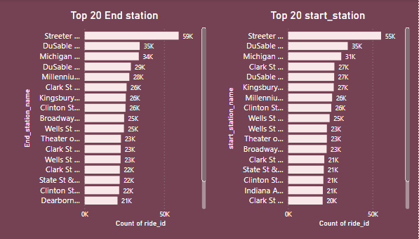

# Cyclistic Bike_share case study

## Introduction

This is a capstone project case study offered by the google data analytic course on Coursera. This capstone project is to test my capability on all that I’ve learnt in the course of the data analytic program. In order to answer the key business questions in this project, its important I follow the steps of the data analysis process: Ask, Prepare, Process, Analyze, Share, And Act.

## Project Background

I am a junior data analyst in Cyclistic's marketing team, a bike-share company in Chicago with over 5,800 bikes and 600 docking stations. Cyclistic stands out by offering diverse bike options, including reclining bikes, hand tricycles, and cargo bikes, catering to people with disabilities. While most riders choose traditional bikes, 8% use assistive options. Cyclistic users predominantly ride for leisure, but 30% use bikes for daily commuting. The marketing director emphasizes the importance of increasing annual memberships for future success. My team aims to analyze how casual riders and annual members differ in their bike usage to create a targeted marketing strategy for converting casual riders into annual members.

## About the company

The project utilizes a historical bike dataset from Cyclistic, available on the AWS file server, sourced from the City of Chicago and Cyclistic company. The data, publicly accessible and credible under Motivate International inc.'s license, offers accurate, complete, and unbiased information on Cyclistic's bike trips. With 63 datasets spanning 2020 to 2023, the project focuses on downloading zip files from December 2022 to November 2023 to ensure current information. These files are stored and extracted separately to maintain organization. While 12 CSV files represent monthly records, it's important to note that data privacy safeguards riders' personal information, preventing connections between pass purchases and credit card details.
### Stakeholders
+ The marketing director and manager, Lily Moreno, lead the development of campaigns and initiatives for the bike-share program. This includes utilizing channels such as email, social media, and others.
+ The Cyclistic marketing analytics team, comprised of data analysts, is tasked with collecting, analyzing, and reporting data to shape the marketing strategy. In my six months with the team as a junior data analyst, I've been learning about Cyclistic's mission, business goals, and how my role contributes to achieving them.
+ The meticulous Cyclistic executive team will make the final decision on whether to approve the proposed marketing program.

**Methodology**
The data analysis processing which are: Ask, Prepare, Process, Analyze, Share and Act will be adopted to ensure a well-developed result.
In this project, the following are the questions to be asked and answered in other to guide the future marketing program.

1. How do annual members and casual riders use Cyclistic bikes differently?
2. Why would casual riders buy Cyclistic annual memberships?
3. How can Cyclistic use digital media to influence casual riders to become members?

## Preparing the Data

The project relies on a historical Cyclistic bike dataset is accessible on the AWS file server using this [link](https://divvy-tripdata.s3.amazonaws.com/index.html). This data is provided by the City of Chicago and Cyclistic company, is reliable, original, and publicly available. Motivate International Inc. has made the data accessible under this [license](https://divvybikes.com/data-license-agreement), confirming its credibility.

These publicly available sources from Cyclistic and the City of Chicago, including governmental agency data and are typically reliable. The project involves 63 datasets which is available on the site and stored as zip files covering years 2020 to 2023. To ensure current information, zip files will be downloaded from December 2022 to November 2023, organized into separate folders to avoid confusion between zip and extracted files. Twelve CSV files which represents each month was extracted into a designated folder.

It's essential to note that data privacy considerations prevent the use of personally identifiable information of riders. Rider personal information is exclusively kept private by Cyclistic, and data users cannot link pass purchases to credit card numbers or determine if casual riders reside in the Cyclistic service area or have bought multiple single passes.
Below is an image of the extracted downloaded data.

## Processing the data

Processing the data includes cleaning and transforming the data. In processing this data I made use of excel spreadsheet, SQL and PowerBI for visualization.
Firstly, I imported the extracted data into excel following this steps:

+ click on DATA on the ribbon pane -> Get Data -> from file -> from Text/CSV.

locate the folder where the data is saved and begin to import then one after the other.
Each dataset would be imported into the excel power query engine, each table of dataset has 13 columns with different row numbers and we have 5,677,670 rows in total from all tables combined. 

* Ride_id - represents unique number of ride
* rideable type - represents Type of bike 
* started at - represents time bike trip started
* ended at - represent time bike trip ended
* start station id - represent start station id for trip
* start station name - represent the start station name
* ended station name - represent End station id for trip
* end station id - represent end station name
* start_lat - latitude of start station
* start_lng - longitude of state station
* end_lng - Latitude of end statiom
* end_lat - Longitude of End station
* member_casual - represent user type

### cleaning the Data

Each table most be inspected for any form of data anomalies and inconsistencies e.g. datatypes, spellings, duplicate values, nulls and errors where necessary. Some tables contain errors and null values which have to be corrected and removed. columns like Started_station_id, Start_station_name, End_station_id,End_station_name contains errors and null values.
To remove this error follow this steps.
* _right click on each columns containing errors  -> select remove errors_.
After removing all errors, 
* _clicked on _Close and Apply_ to apply changes on data and load them to excel spreadsheet_.
  
Next step, is to change the datatypes of columns started_at and ended_at, reason for this is for further cleaning and combining the tables in sql and  since sql use a different datetype from the csv original datetype. The tables cant be combined on the spreadsheet because it is a large file and spreadsheet has limited number of rows it can take. 
To achieve this follow this steps:
* _click on Number pane on the ribbon -> custom_ 
* _Edit datetime format and change to yyyy-mm-dd h:mm:ss_
  
Now use _SAVE AS_ to save each table in csv format into another folder, it is this saved tables that would be imported into the sql server.
To import the saved data table into sql server, follow this steps:

* _Launch the sql server_
* _connect to the object browser_
* _crease a database to house the table_
* _right click on the database_
* _select tasks and click import flat file_

After importing the data into sql server, next is to combine all the tables into one and clean the tables properly. 
Here is the [link](https://github.com/Olaseni-Ajeboriogbon/Google-Data-Analysis-capstone-project/blob/main/cyclistic_Bike_share.sql) to the sql codes used in combining and cleaning the table. 

To further process the data inorder to draw insights, the combined data in sql server was imported to powerbi using directquery method. To import data into powerbi using Directquery method follow this steps:
* Lauch powerbi
* click GET DATA on the ribbon -> SQL SERVER
* insert sql server name and click OK
* select Import
* select the database and click on the combined data, this imports the combined data into powerquerry of the powerbi.

After importing to powerbi, i created new columns (Time of day, period of day, season of the year, months, monthname, dayname, day) using conditional statements to aid my analysis.
Here is a [link](https://drive.google.com/file/d/1cD9EDTm0RyKjTJt5293lGUiELrJU41Fx/view?usp=sharing) to the processed data on powerbi.

## DATA VISUALIZATION

The report comprises of four pages with different analysis.

page one                               |             page two                |page three                            |page four
:-------------------------------------:|:-----------------------------------:|:------------------------------------:|:------------------------------------:
  |  |     |

